# Kotak Neo AI Algo Trading Terminal

A full-stack algorithmic trading terminal for Kotak Neo Securities with AI-powered analysis, NSE public option chain data, real-time risk management, automated strategy execution, and a premium institutional-grade UI.

Built with Flask + vanilla JS — no frontend framework, no build step. Premium dark glassmorphism UI with CSS custom properties, mobile responsive sidebar, and real-time data streaming.

---

## 📋 Table of Contents

- [Features Overview](#features-overview)
- [Tech Stack](#tech-stack)
- [Project Structure](#project-structure)
- [Quick Start](#quick-start)
- [Configuration](#configuration)
- [Pages & Tabs Walkthrough](#pages--tabs-walkthrough)
- [Option Chain (NSE Public API)](#option-chain-nse-public-api)
- [AI Assistant](#ai-assistant)
- [Algo Trading Engine](#algo-trading-engine)
- [Risk Management](#risk-management)
- [Technical Indicators & Charts](#technical-indicators--charts)
- [Kotak Neo API Integration](#kotak-neo-api-integration)
- [Angel One Data Source](#angel-one-data-source)
- [Alerts System](#alerts-system)
- [Telegram Alerts](#telegram-alerts)
- [Deployment](#deployment)
- [API Reference](#api-reference)
- [Screenshots](#screenshots)
- [Disclaimer](#disclaimer)

---

## Features Overview

### 📊 Dashboard
- Real-time P&L from open positions
- Portfolio summary with day change, MTM, and exposure
- Kill switch (one-click emergency stop)
- Quick-access stats cards

### 🎨 Premium UI (Neo Institutional Dark)
- Dark glassmorphism design with `#040B14` background
- `--bg-panel`, `--bg-card`, `--text-secondary/muted/disabled`, `--border-hover` CSS variable system
- `backdrop-filter: blur(16px)` glass cards
- Gradient primary buttons (`#00FFC6` → `#00B8FF`)
- Radial ambient background gradients
- Inter + JetBrains Mono font stack
- Refined tables, inputs, scrollbars, chart containers

### 📈 Market Data
- **Quotes**: Live LTP, volume, bid/ask, change for any symbol
- **Scrip Master**: Browse all tradable instruments
- **Funds & Limits**: View margin, cash, and position limits
- **Technical Analysis**: 
  - Candlestick charts (Lightweight Charts by TradingView)
  - RSI, MACD, EMA 20/50, Bollinger Bands, SuperTrend
  - Ichimoku Cloud (Tenkan, Kijun, Senkou Span A/B)
  - Fibonacci Retracement levels overlay
  - VWAP, ATR, Volume analysis

### 🎯 Option Chain (NSE Public - Free)
- **No API key required** — uses NSE public APIs with cookie-based session
- **Indices**: NIFTY, BANKNIFTY, FINNIFTY, SENSEX, MIDCPNIFTY
- **Stocks**: 200+ underlying stocks with options
- **Weekly expiry** auto-populated from NSE
- **17-column table**: Strike | CE LTP/OI/OI Chg/IV/Bid/Ask/Vol/Chg | PE LTP/OI/OI Chg/IV/Bid/Ask/Vol/Chg
- **Underlying separator** row at the strike nearest spot price
- **Key metrics**: PCR, Max Pain, OI concentration, total CE/PE OI
- **Auto-refresh toggle** (3-second polling)
- **AI-powered analysis** of top OTM strikes

### 🤖 AI Assistant (Groq)
- **AI Chat**: Trading-aware conversational assistant
- **Market Analysis**: Trend, momentum, S/R levels, buy/sell signal
- **Strategy Generator**: Creates trading strategies based on your parameters
- **Risk Assessment**: Portfolio exposure, drawdown risk, position sizing
- **Sentiment Analysis**: Market mood, institutional activity
- **Trade Journal Analysis**: AI reviews your trades, identifies mistakes and patterns
- **Option Chain Analysis**: Detailed bias, OI clustering, IV skew, support/resistance, strategy recommendations

### 🔄 Algo Trading Engine
- **Background loop** evaluates strategies at per-strategy interval (1m–1d)
- **Strategy Builder**: 4-condition model — Entry Long, Exit Long, Entry Short, Exit Short
- **12 Condition Types**: EMA crossover, RSI, MACD, Bollinger Bands, SuperTrend, volume spike, VWAP, price vs EMA
- **6 Pre-built Templates**: EMA Crossover, RSI Mean Reversion, Bollinger Squeeze, MACD Crossover, SuperTrend Long Only, VWAP+EMA Long Only
- **Customizable indicator params**: period, fast/slow periods, value thresholds — displayed as JSON tags
- **Per-strategy interval**: Each strategy runs at its own 1m/3m/5m/15m/30m/1h/1d interval
- **Long + Short sides**: Separate entry/exit conditions for both directions
- **Backtesting**: Run strategies against historical Angel One + yfinance data (win rate, PnL, trade log)
- **Live Execution**: Auto-place orders via Kotak Neo API when conditions trigger
- **Copy to Live Trade**: Execute paper-trade signals as real orders
- **Kill Switch**: Instantly cancel all orders and block new ones

### 🔔 Alerts System
- **Independent alert checker**: Runs every 30s, fetches LTP from Angel One regardless of watchlist state
- **Price alerts**: Above/below conditions with symbol matching (handles `-EQ` suffix)
- **Sound alerts**: Two-tone chime (C5→E5) via Web Audio API, 15% gain, autoplay-safe
- **Browser notifications**: Desktop Notification API integration

### ⚠️ Risk Management
- Daily loss limit (auto-stop trading)
- Max trades per day limit
- Max position size cap
- Kill switch (cancels all open orders + blocks placement)
- AI risk advisor for portfolio-level risk analysis
- Visual risk bar showing loss limit utilization

---

## Tech Stack

| Layer | Technology |
|-------|-----------|
| **Backend** | Python 3.13, Flask, Flask-SocketIO |
| **Frontend** | Vanilla JavaScript, HTML5, CSS3 |
| **UI Theme** | Neo Institutional Dark — glassmorphism, CSS custom properties |
| **Charts** | Lightweight Charts (TradingView) via CDN |
| **AI** | Groq API (`openai/gpt-oss-20b`) |
| **Broker** | Kotak Neo API v2 SDK (`neo_api_client`) |
| **Historical Data** | Angel One SmartAPI (primary) + yfinance (fallback) |
| **Live LTP** | Angel One SmartAPI REST quotes |
| **Option Chain** | NSE Public API (free, cookie-based session) |
| **Auth** | TOTP via `pyotp` |
| **Notifications** | Telegram Bot API + Web Audio API + Browser Notification API |
| **Data Storage** | JSON files (strategies, trade logs) |
| **Real-time** | Flask-SocketIO (WebSocket) |
| **Indicators** | C++ accelerated module (`algo_core`) + Python fallback |

---

## Project Structure

```
📁 Kotak-Neo-Algo/
├── 📄 app.py                       # Flask app — 57+ API routes
├── 📄 algo_engine.py               # Strategy engine, backtesting, indicators, Angel One data
├── 📄 ai_assistant.py              # Groq AI integration (TradingAIAssistant)
├── 📄 websocket_handler.py         # WebSocket live data handler stub
├── 📁 templates/
│   └── 📄 index.html              # Single-page UI (~4000 lines)
├── 📁 sensibull-bridge/            # Sensibull data bridge (experimental)
├── 📁 algo_core/                   # C++ accelerated indicator module
├── 📄 .env                         # Kotak Neo credentials (gitignored)
├── 📄 .env.angel                   # Angel One SmartAPI credentials (gitignored)
├── 📄 .gitignore
├── 📄 README.md
├── 📄 requirements.txt             # Python dependencies
├── 📄 algo_strategies.json         # Saved strategies (auto-generated)
├── 📄 algo_trade_log.json          # Trade logs (auto-generated)
│
# Test/utility scripts (not part of main app):
├── 📄 trade_test.py                # NeoAPI connection test
├── 📄 trade_test_fix.py            # NeoAPI test with fixes
├── 📄 test_trade.py                # Basic order placement test
├── 📄 test_trade_token.py          # Token-based auth test
├── 📄 trade_raw.py                 # Raw HTTP order placement test
├── 📄 prefetch_market_data.py      # Pre-fetch historical data script
└── 📄 test_angel_historical.py     # Angel One historical data test
```

---

## Quick Start

```bash
# 1. Clone the repository
git clone https://github.com/danny8806/Kotak-Neo-Algo.git
cd Kotak-Neo-Algo

# 2. Create virtual environment
python3 -m venv venv
source venv/bin/activate        # Linux/Mac
# venv\Scripts\activate         # Windows

# 3. Install dependencies
pip install -r requirements.txt

# 4. Configure environment
cp .env.example .env
# Edit .env with your Kotak Neo credentials
# Create .env.angel with your Angel One SmartAPI credentials

# 5. Run the server
python app.py

# 6. Open in browser
# http://localhost:8080
```

---

## Configuration

Create a `.env` file in the project root:

```env
# === GROQ AI (required for AI features) ===
GROQ_API_KEY=gsk_xxxxxxxxxxxxxxxxxxxxxxxxxxxxxxxxxxxxxxxxxxxx

# === Kotak Neo Trading (required for orders, positions, holdings) ===
CONSUMER_KEY=xxxxxxxx-xxxx-xxxx-xxxx-xxxxxxxxxxxx
MOBILE_NUMBER=+9198xxxxxxxx
UCC=XXXXX
MPIN=123456

# === Telegram (optional — for alerts) ===
TELEGRAM_BOT_TOKEN=1234567890:ABCdefGHIjklMNOpqrsTUVwxyz
TELEGRAM_CHAT_ID=123456789
```

Create a `.env.angel` file for Angel One SmartAPI (used for historical data + live LTP):

```env
ANGEL_API_KEY=your_api_key
ANGEL_CLIENT_ID=your_client_id
ANGEL_PASSWORD=your_password
ANGEL_TOTP_SECRET=your_totp_secret
```

### Getting Credentials

1. **GROQ_API_KEY**: Sign up at [console.groq.com](https://console.groq.com) → Create API key
2. **CONSUMER_KEY**: Generate at [Kotak Neo Dashboard](https://neo.kotaksecurities.com) → API → Consumer Key
3. **MOBILE_NUMBER**: Your registered Kotak Neo mobile number with country code
4. **UCC**: Your Kotak Neo trading ID
5. **MPIN**: Your Kotak Neo MPIN (used for session validation)
6. **ANGEL_API_KEY**: Generate at [Angel One SmartAPI](https://smartapi.angelbroking.com)
7. **TELEGRAM**: Create bot via [@BotFather](https://t.me/BotFather) on Telegram, get chat ID from [@userinfobot](https://t.me/userinfobot)

### IP Whitelisting

Kotak Neo requires your public IP to be whitelisted:

```bash
curl ifconfig.me
```

Add the returned IP at [Kotak Neo Dashboard](https://neo.kotaksecurities.com) → API → IP Whitelist.

---

## Pages & Tabs Walkthrough

### 1. Dashboard (`page-dashboard`)
- Quick stats: Connected status, funds, positions count
- Live P&L with day change (green/red)
- Portfolio exposure summary
- Kill switch toggle (bottom-right floating button)

### 2. Orders (`page-orders`)
- View all orders (open, executed, cancelled)
- Filter by status and exchange
- Place new orders with full parameter control
- Modify and cancel existing orders
- Order book with color-coded status badges

### 3. Option Chain (`page-options`)
- **Mode selector**: Indices (dropdown) / Stocks (text input with autocomplete)
- **Symbol selection**: Indices from NSE, stocks with 200+ autocomplete options
- **Expiry dropdown**: Auto-populated from NSE API, defaults to weekly near
- **Stats cards**: PCR, Max Pain, Total CE OI, Total PE OI
- **Full 17-column table** with CE/PE side-by-side
- **Auto-refresh toggle**: 3-second polling
- **AI Analyze button**: Sends top OTM strikes to Groq for detailed analysis

### 4. Watchlist (`page-watchlist`)
- User-managed watchlist stored in localStorage
- Real-time LTP updates
- Add/remove symbols
- Color-coded change indicators

### 5. Market Data (`page-market-data`)
- **Quotes tab**: Live LTP, bid/ask, volume, change
- **Scrip Master tab**: Browse all instruments with search
- **Funds & Limits tab**: View margin, cash, adhoc limits
- **Technical Indicators card**:
  - Symbol + interval + period selector
  - RSI, MACD, EMA 20/50 crossover signal, Bollinger Band position
  - Interactive candlestick chart with volume, EMA overlay, Ichimoku Cloud, Fibonacci levels

### 6. AI Tools (`page-ai-tools`)
- **AI Chat**: Free-form trading questions with context awareness
- **Market Analysis**: Submit symbol + timeframe for AI analysis
- **Strategy Generation**: AI creates custom trading strategies
- **Risk Assessment**: Portfolio risk evaluation
- **Trade Journal**: Paste trade data for AI review
- **Sentiment Analysis**: AI reads market mood

### 7. Alerts (`page-alerts`)
- Set price alerts (above/below conditions)
- Independent LTP fetcher (Angel One REST, 30s interval)
- Sound alerts via Web Audio API (two-tone chime)
- Desktop notifications via browser Notification API
- Telegram bot integration
- Active alerts list with remove functionality

### 8. Algo Trading (`page-algo`)
- **Strategy builder**: 4-condition model with long/short panels
  - Entry Long / Exit Long (green bordered panel)
  - Entry Short / Exit Short (red bordered panel)
  - Per-strategy interval selector (1m–1d)
  - Customizable indicator parameters with JSON tag display
  - 6 pre-built templates
- **Strategies list**: All saved strategies with L→E S→E summary
- **Backtest**: Run against historical data (Angel One + yfinance) with:
  - Exchange (NSE/BSE), from/to date selectors
  - Trade table with Side column (long/short)
  - Win rate, P&L, signals
- **Live Trading**: Enabled strategies auto-execute at their configured interval
- **Signal Panel**: Latest signal with Copy to Live Trade button
- **Trade Log**: All engine-generated trades with action, symbol, price, quantity

### 9. Risk Management (`page-risk-management`)
- Enable/disable risk management
- Daily loss limit, max trades, max position size
- AI Risk Advisor
- Portfolio Risk Scan
- Kill Switch
- Risk Status Panel

---

## Option Chain (NSE Public API)

### How It Works

The NSE option chain uses a `requests.Session()` with browser-like headers — **no API key needed**.

### Session Initialization

```python
s = requests.Session()
s.headers.update({
    "user-agent": "Mozilla/5.0 ...",
    "accept-language": "en,gu;q=0.9,hi;q=0.8",
})
s.get("https://www.nseindia.com/option-chain")
```

### API Calls

1. **Symbols**: `GET https://www.nseindia.com/api/underlying-information`
2. **Expiry Dates**: `GET https://www.nseindia.com/api/option-chain-contract-info?symbol={symbol}`
3. **Option Chain**: `GET https://www.nseindia.com/api/option-chain-v3?type=Indices&symbol={symbol}&expiry={date}`

### Max Pain Calculation

```python
for strike S:
    loss = 0
    for strike O:
        if O is CE and O.strike <= S: loss += O.oi * (S - O.strike)
        if O is PE and O.strike >= S: loss += O.oi * (O.strike - S)
    losses[S] = loss
max_pain = strike with minimum loss
```

---

## AI Assistant

### Architecture

```
TradingAIAssistant
├── chat_query()                 # Main chat with conversation history
├── analyze_market_data()        # Market analysis
├── generate_trading_strategy()  # Strategy creation
├── risk_assessment()            # Portfolio risk evaluation
├── market_sentiment_analysis()  # Sentiment
├── option_chain_analysis()      # Options data analysis
├── trade_decision()             # Trade evaluation
├── analyze_trades()             # Trade journal review
```

- **Model**: `openai/gpt-oss-20b` (via Groq), temp 0.4–0.7
- **Rate limits**: 8000 TPM, 200K TPD free tier
- **Mock mode**: Falls back to canned responses if `GROQ_API_KEY` unset

---

## Algo Trading Engine

### Engine Architecture

```
Background Thread (daemon=True)
└── engine_loop()
    └── Every 60 seconds:
        1. Load all enabled strategies from JSON
        2. For each strategy:
            a. Fetch data at strategy's configured interval (1m–1d)
            b. Compute indicators (EMA, RSI, MACD, BB, SuperTrend, VWAP, etc.)
            c. Evaluate 4 condition groups:
               - Entry Long (AND logic)
               - Exit Long (AND logic)
               - Entry Short (AND logic)
               - Exit Short (AND logic)
            d. Track positions in engine_state['positions']
            e. Place order via NeoAPI if kill switch is OFF
            f. Log entry as BUY_SIGNAL/SELL_SIGNAL if kill switch is ON (paper mode)
        3. Sleep 60 seconds
```

### 12 Condition Types

| Tag | Logic | Param |
|-----|-------|-------|
| `price_above_ema` | Close > EMA | `period` (default 9) |
| `price_below_ema` | Close < EMA | `period` (default 9) |
| `ema_cross_above` | EMA fast crosses above EMA slow | `fast_period`, `slow_period` |
| `ema_cross_below` | EMA fast crosses below EMA slow | `fast_period`, `slow_period` |
| `rsi_above` | RSI > threshold | `period`, `value` |
| `rsi_below` | RSI < threshold | `period`, `value` |
| `macd_cross_above` | MACD crosses above signal | `fast_period`, `slow_period` |
| `macd_cross_below` | MACD crosses below signal | `fast_period`, `slow_period` |
| `price_above_bb_upper` | Close > BB upper band | `period` |
| `price_below_bb_lower` | Close < BB lower band | `period` |
| `supertrend_buy` | SuperTrend flips to uptrend | `period`, `value` (multiplier) |
| `supertrend_sell` | SuperTrend flips to downtrend | `period`, `value` (multiplier) |
| `volume_spike` | Volume > avg * multiplier | `value` (multiplier) |
| `price_above_vwap` | Close > VWAP | — |
| `price_below_vwap` | Close < VWAP | — |

### Strategy Templates (6)

| Template | Long Entry | Long Exit | Short Entry | Short Exit | Interval |
|----------|-----------|-----------|-------------|------------|----------|
| **EMA 12/26 Crossover** | EMA12 × EMA26 ↑ | EMA12 × EMA26 ↓ | EMA12 × EMA26 ↓ | EMA12 × EMA26 ↑ | 15m |
| **RSI Mean Reversion** | RSI ≤ 30 | RSI ≥ 70 | RSI ≥ 70 | RSI ≤ 30 | 15m |
| **Bollinger Squeeze** | Price > BB Upper | Price < BB Lower | Price < BB Lower | Price > BB Upper | 15m |
| **MACD Crossover** | MACD × Signal ↑ | MACD × Signal ↓ | MACD × Signal ↓ | MACD × Signal ↑ | 15m |
| **SuperTrend Long Only** | SuperTrend Buy | SuperTrend Sell | — | — | 5m |
| **VWAP+EMA Long Only** | Price > VWAP AND Price > EMA20 | Price < VWAP | — | — | 5m |

### Strategy Format

```json
{
  "name": "EMA Crossover",
  "symbol": "SBIN",
  "interval": "15m",
  "quantity": 1,
  "stop_loss": 2.0,
  "target": 4.0,
  "entry_long_conds": [
    {"tag": "ema_cross_above", "fast_period": 12, "slow_period": 26}
  ],
  "exit_long_conds": [
    {"tag": "ema_cross_below", "fast_period": 12, "slow_period": 26}
  ],
  "entry_short_conds": [
    {"tag": "ema_cross_below", "fast_period": 12, "slow_period": 26}
  ],
  "exit_short_conds": [
    {"tag": "ema_cross_above", "fast_period": 12, "slow_period": 26}
  ]
}
```

### Backtesting

```python
run_backtest(strategy, symbol, interval, period, fromdate, todate, exchange)
```

- Fetches historical data via Angel One SmartAPI (primary) → yfinance (fallback)
- Angel One data supports: 1m (30d), 3m (60d), 5m/10m (100d), 15m/30m (200d), 1h (400d), 1d (2000d)
- Computes all indicators, walks through bars sequentially
- Tracks position state, entry/exit for both long and short
- Applies stop loss / target for both directions
- C++ accelerated path for long-only; Python path for long+short
- Returns: trades array with `side`, `entry_price`, `exit_price`, `pnl_pct`, `reason`

### Signal Execution

- `POST /api/algo/execute-signal` — Places a live market order from a paper signal
- Validates login state, kill switch, symbol/action/qty
- Logs as `BUY_LIVE`/`SELL_LIVE` with response
- UI shows "Copy to Live Trade" button on every `BUY_SIGNAL`/`SELL_SIGNAL` row

### Data Source Priority

1. **Angel One SmartAPI** — `getCandleData()` REST API (33 mapped NSE tokens + exchange/interval params)
2. **Yahoo Finance** — yfinance download as fallback (any symbol)

Angel One token map covers 33 major NSE stocks. Symbols not in the map fall through to Yahoo Finance automatically.

---

## Angel One Data Source

### Token Mapping

```python
ANGEL_TOKEN_MAP = {
    "SBIN": "3045", "RELIANCE": "2885", "HDFCBANK": "1333",
    "ICICIBANK": "4963", "INFY": "1594", "TCS": "11536",
    # ... 33 stocks total
}
```

### Supported Intervals

| Interval | Angel One | Max Days |
|----------|-----------|----------|
| 1m | ONE_MINUTE | 30 |
| 3m | THREE_MINUTE | 60 |
| 5m | FIVE_MINUTE | 100 |
| 10m | TEN_MINUTE | 100 |
| 15m | FIFTEEN_MINUTE | 200 |
| 30m | THIRTY_MINUTE | 200 |
| 1h | ONE_HOUR | 400 |
| 1d | ONE_DAY | 2000 |

---

## Alerts System

### Independent Alert Checker

Unlike the watchlist-based polling, the alert system has its own dedicated checker:

```
restartAlertChecker()
└── Every 30 seconds:
    1. Fetch LTP from Angel One quotes API for all alert symbols
    2. Compare against alert thresholds (above/below)
    3. Fire notification + sound on trigger
```

### Sound Alerts

```javascript
function playAlertSound() {
    const ctx = new AudioContext();
    const osc = ctx.createOscillator();
    osc.frequency.value = 523.25;  // C5
    // Then E5 after 80ms
    osc.type = 'sine';
    osc.connect(ctx.createGain());  // 15% gain
}
```

- Zero external dependencies
- Handles browser autoplay policy
- Two-tone chime (C5 → E5)

---

## Kotak Neo API Integration

### Login Flow

```python
client = NeoAPI(environment='prod', consumer_key=CONSUMER_KEY)
# Step 1: TOTP Login
login = client.totp_login(mobile_number="+9198...", ucc="XXXXX", totp=TOTP)
# Step 2: Validate session
session = client.totp_validate(mpin="123456")
```

### Key SDK Methods

| Method | Purpose |
|--------|---------|
| `totp_login()` | Initiate TOTP-based login |
| `totp_validate()` | Validate session with MPIN |
| `place_order()` | Place new order |
| `modify_order()` | Modify existing order |
| `cancel_order()` | Cancel order |
| `positions()` | Get open positions |
| `holdings()` | Get portfolio holdings |
| `orders()` | Get order book |
| `quotes()` | Get live quotes |
| `limits()` | Get margin/limits |

### Error 100008 (Unauthorized)

Occurs when session tokens don't match the current consumer key. Fix: Re-login with a fresh TOTP.

---

## Risk Management

### Components

1. **Daily Loss Limit**: Auto-stops trading when daily P&L hits threshold
2. **Max Trades Per Day**: Prevents overtrading
3. **Max Position Size**: Caps single order value
4. **Kill Switch**: One-click emergency stop (cancels all orders + blocks placement)

### Kill Switch Flow

1. User clicks "KILL ON" button
2. `POST /api/kill-switch` sets `kill_switch_active = True`
3. Fetches all open orders via NeoAPI and cancels each
4. All subsequent `place_order()` calls return 403
5. Algo engine skips all cycles, logs `BUY_SIGNAL`/`SELL_SIGNAL` instead of live orders

---

## Technical Indicators & Charts

All indicators computed client-side in JavaScript:

| Function | Description |
|----------|-------------|
| `calcSMA()` | Simple moving average |
| `calcEMA()` | Exponential moving average |
| `calcRSI()` | Relative Strength Index |
| `calcMACD()` | MACD + signal + histogram |
| `calcBB()` | Bollinger Bands (upper/mid/lower) |
| `calcSuperTrend()` | ATR-based trend following |
| `calcIchimoku()` | Tenkan/Kijun + Senkou Span A/B |
| `calcFibonacciLevels()` | 0/23.6/38.2/50/61.8/78.6/100% |

Chart overlays: candles, volume, EMA 20/50, Ichimoku Cloud, Fibonacci levels.

---

## Deployment

```bash
python app.py
# Runs on http://0.0.0.0:8080
```

For production (Render / Railway / Fly.io):
```
web: gunicorn -k eventlet -w 1 app:app
```

**Note**: Kotak Neo requires IP whitelisting — cloud deployments with dynamic IPs may break login/orders.

---

## API Reference

### Core Endpoints

| Method | Endpoint | Description |
|--------|----------|-------------|
| GET | `/` | Serve HTML page |
| POST | `/api/login` | Kotak Neo login |
| POST | `/api/logout` | Logout |
| GET | `/api/profile` | User profile |
| GET | `/api/session-debug` | Session debug info |

### Trading Endpoints

| Method | Endpoint | Description |
|--------|----------|-------------|
| POST | `/api/place-order` | Place order |
| POST | `/api/modify-order` | Modify order |
| POST | `/api/cancel-order` | Cancel order |
| GET | `/api/orders` | Get orders |
| GET | `/api/positions` | Get positions |
| GET | `/api/holdings` | Get holdings |
| GET | `/api/quotes` | Get quotes |
| GET | `/api/limits` | Get limits |
| GET | `/api/live-pnl` | Live P&L |
| GET | `/api/order-history` | Order history |
| GET | `/api/trade-report` | Trade report |
| GET | `/api/scrip-master` | Instrument list |
| GET | `/api/search-scrip` | Search instruments |

### Option Chain Endpoints

| Method | Endpoint | Description |
|--------|----------|-------------|
| GET | `/api/option-chain` | Kotak Neo option chain (requires login) |
| GET | `/api/nse/option-chain` | NSE public option chain (free) |
| GET | `/api/nse/symbols` | NSE symbols list |
| GET | `/api/nse/expiry-dates` | NSE expiry dates |

### AI Endpoints

| Method | Endpoint | Description |
|--------|----------|-------------|
| POST | `/api/ai/chat` | AI chat |
| POST | `/api/ai/analyze-market` | Market analysis |
| POST | `/api/ai/generate-strategy` | Strategy generation |
| POST | `/api/ai/risk-assessment` | Risk assessment |
| POST | `/api/ai/sentiment-analysis` | Sentiment analysis |
| POST | `/api/ai/analyze-trades` | Trade journal analysis |
| GET | `/api/ai/analyze-portfolio` | Portfolio analysis |

### Algo Trading Endpoints

| Method | Endpoint | Description |
|--------|----------|-------------|
| GET | `/api/algo/templates` | Strategy templates (6) |
| GET/POST | `/api/algo/strategies` | List/create strategies |
| DELETE | `/api/algo/strategies/<id>` | Delete strategy |
| POST | `/api/algo/strategies/<id>/toggle` | Enable/disable |
| GET | `/api/algo/status` | Engine status |
| POST | `/api/algo/start` | Start engine |
| POST | `/api/algo/stop` | Stop engine |
| GET | `/api/algo/logs` | Trade logs |
| POST | `/api/algo/clear-logs` | Clear trade logs |
| POST | `/api/algo/backtest` | Run backtest |
| POST | `/api/algo/execute-signal` | Execute signal as live order |

### Risk & Alerts

| Method | Endpoint | Description |
|--------|----------|-------------|
| GET/POST | `/api/risk/config` | Risk configuration |
| POST | `/api/risk/update-trade` | Update trade counters |
| POST | `/api/risk/reset` | Reset risk counters |
| GET/POST | `/api/kill-switch` | Kill switch toggle |
| GET | `/api/telegram-config` | Telegram configuration |
| POST | `/api/send-telegram` | Send Telegram message |

---

## Screenshots

| | |
|---|---|
| 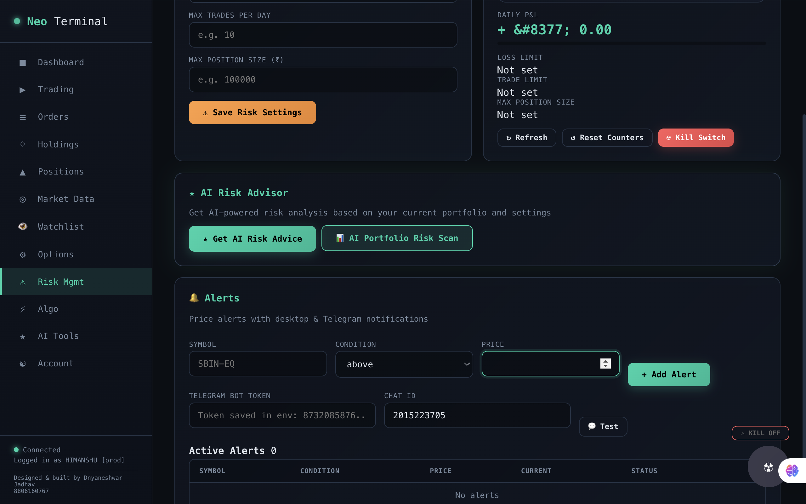 | 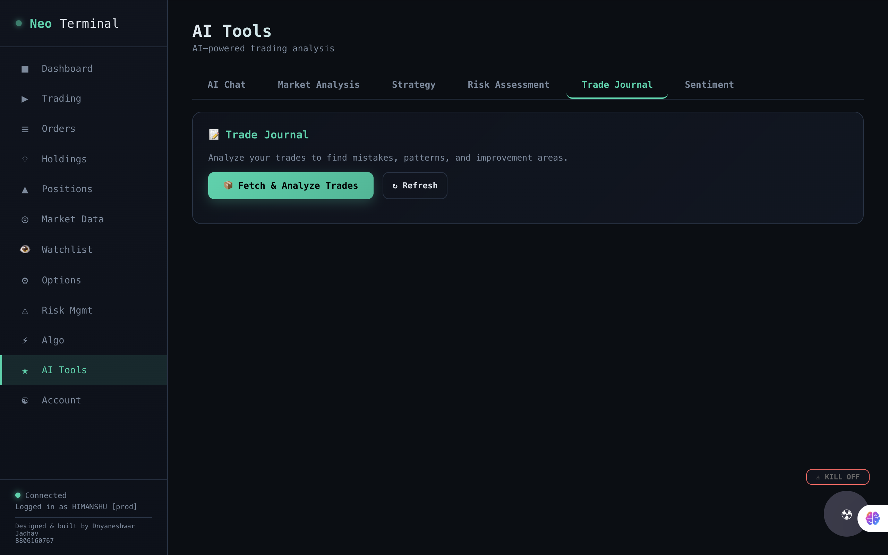 |
| **Dashboard** — P&L, positions, trades, holdings, AI tools | **Orders** — Order book with status badges and refresh |
| 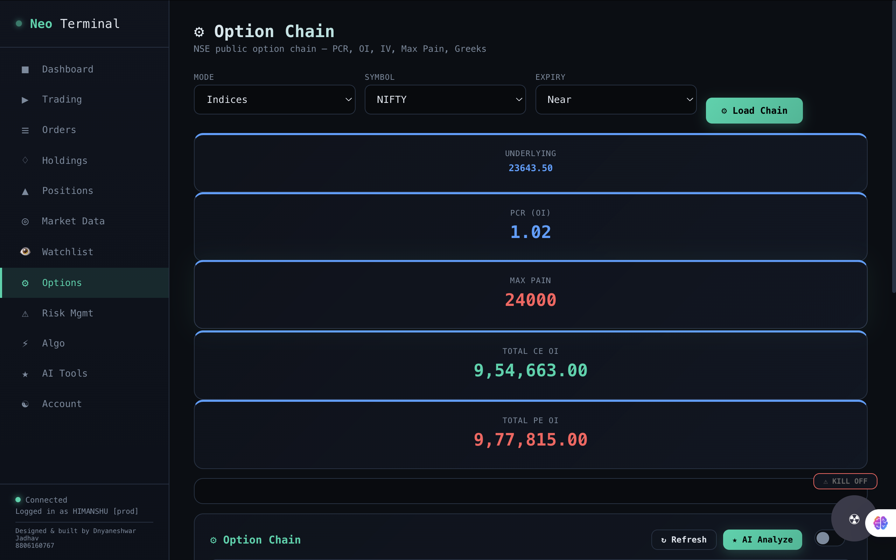 | 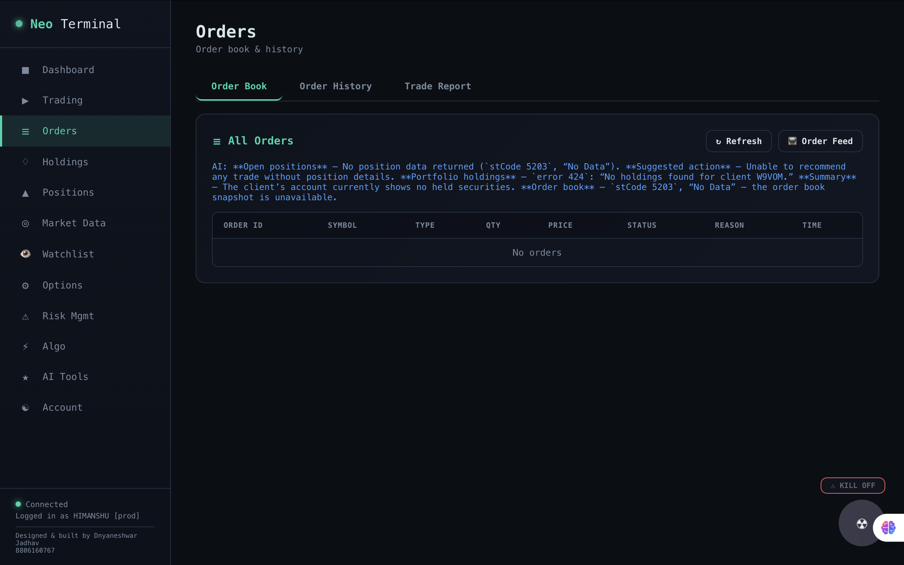 |
| **Order Ticket** — Place/modify/cancel with scrip search & margin | **Option Chain** — Underlying, PCR, Max Pain, CE/PE OI, expiry |
| 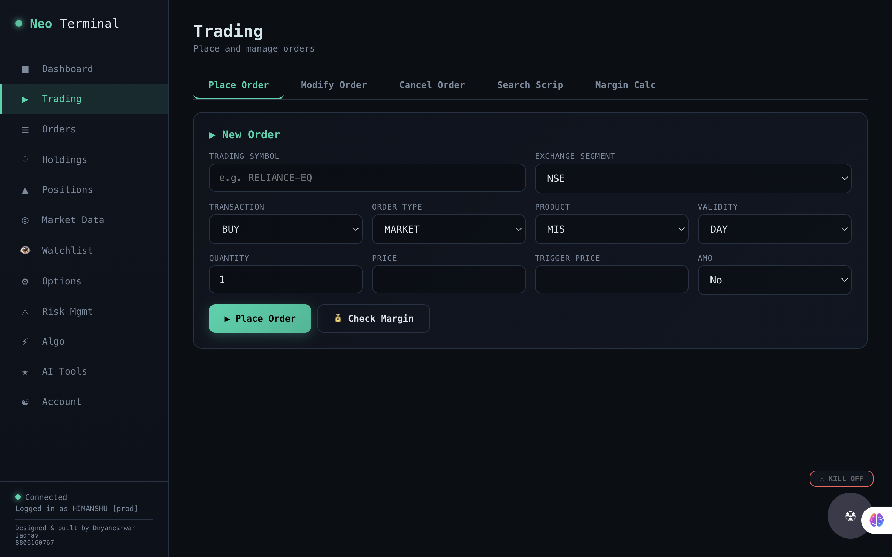 | 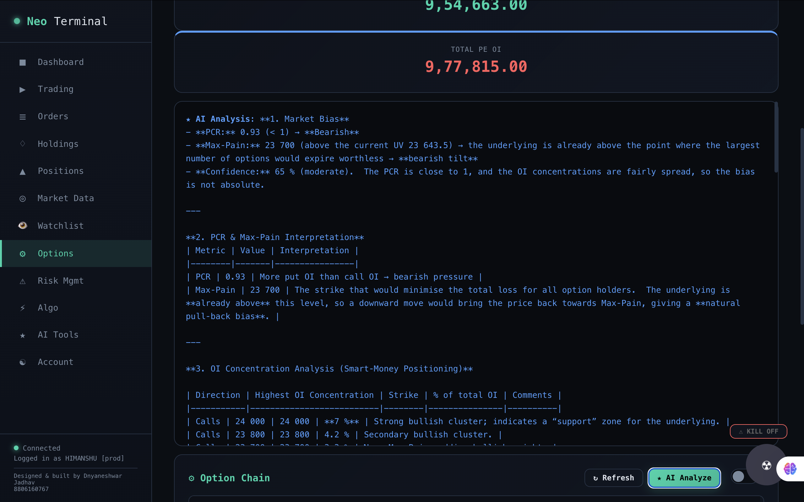 |
| **Option Chain Table** — Strike-wise CE/PE with full data | **AI Analysis** — PCR, max pain, OI concentration, S/R, strategies |
| 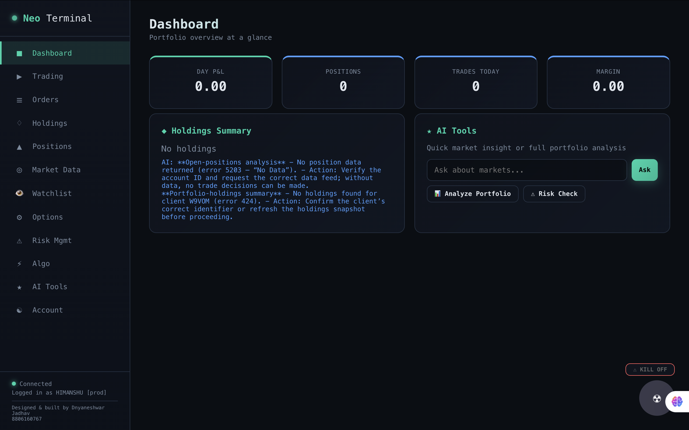 | 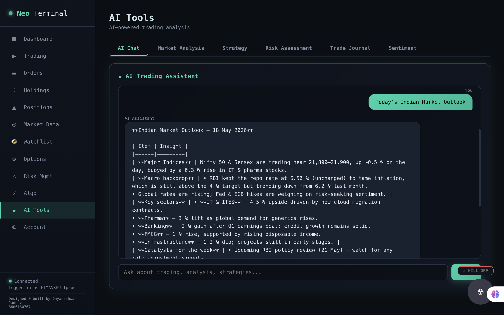 |
| **Technicals** — RSI, MACD, EMA, BB, SuperTrend, VWAP, chart | **AI Chat** — Market outlook, sectors, catalysts, context |
| 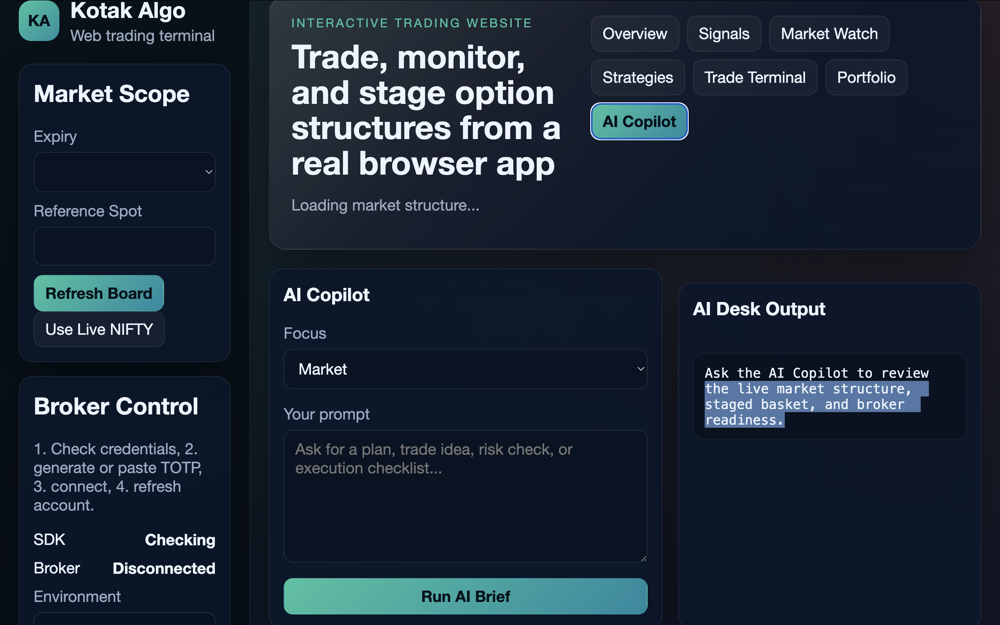 | 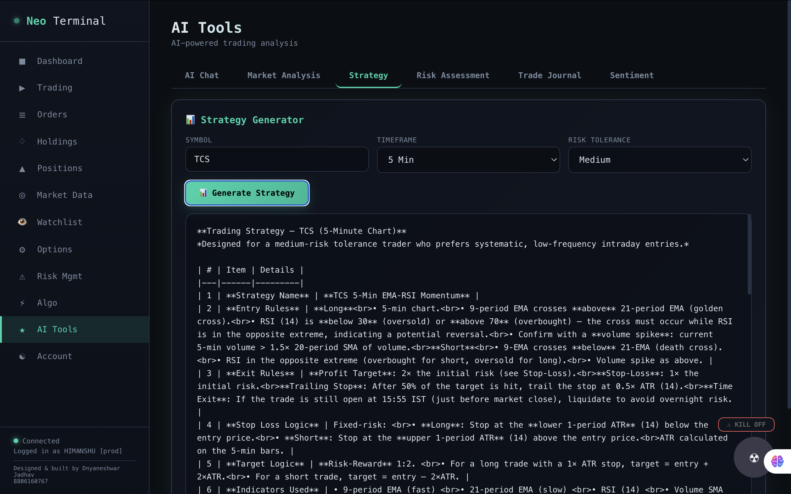 |
| **AI Copilot** — Trading-aware assistant | **Strategy Generator** — Plan from symbol + timeframe + risk |
| 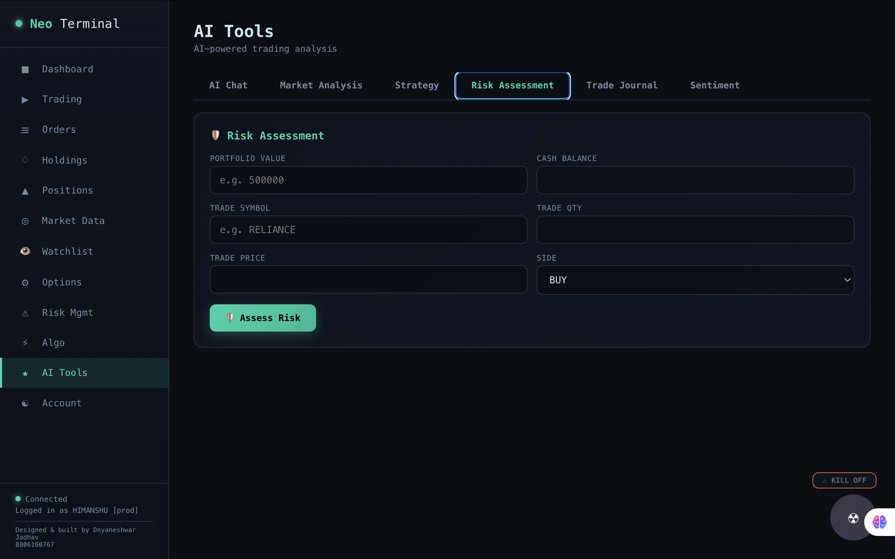 | 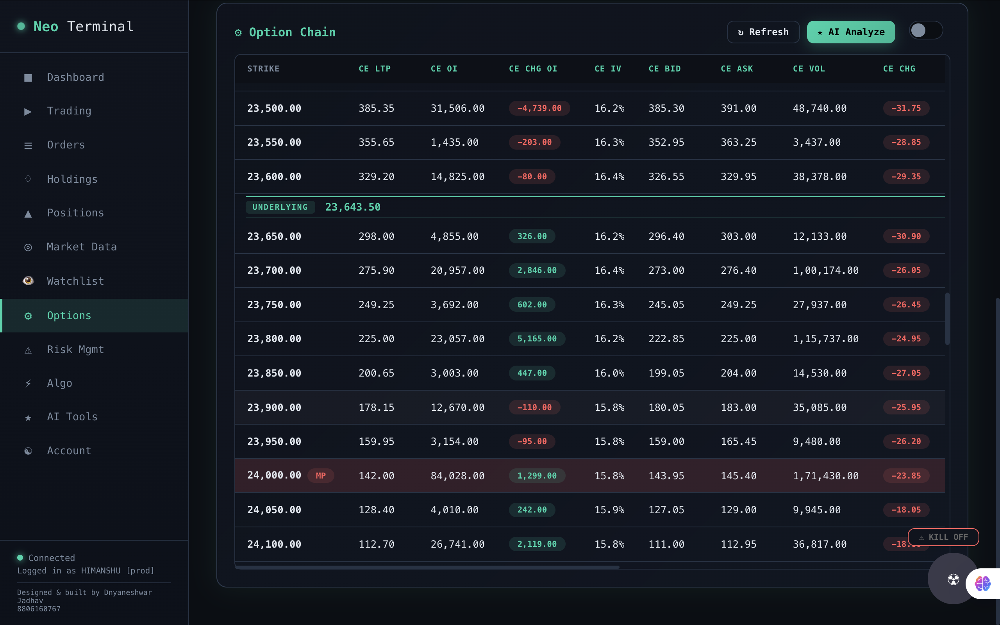 |
| **Risk Assessment** — Portfolio value, cash, position sizing | **Trade Journal** — AI reviews mistakes, patterns, improvements |
| 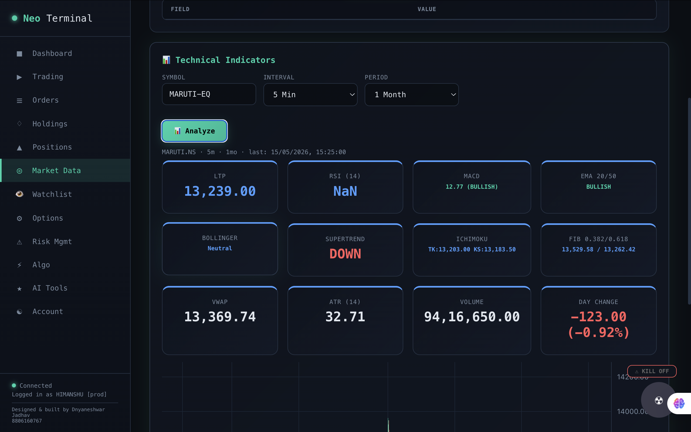 | 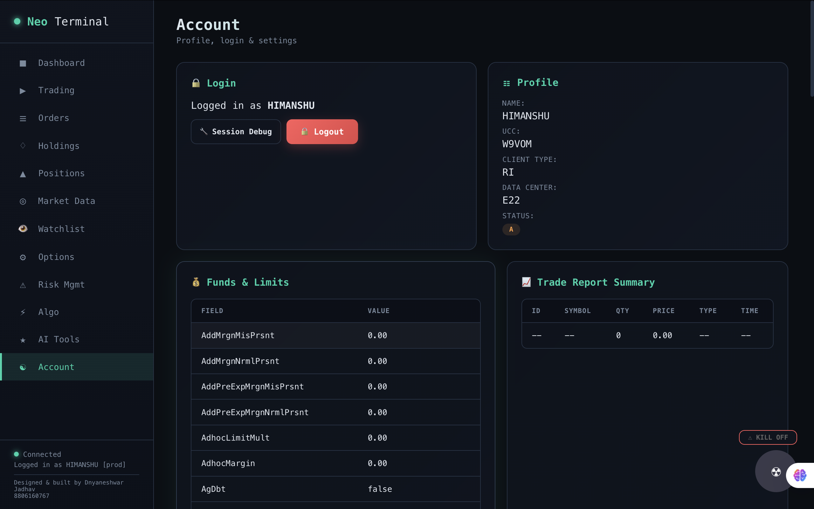 |
| **Risk** — Daily limits, kill switch, AI advice, price alerts | **Profile** — Login status, client details, funds, trade report |
| 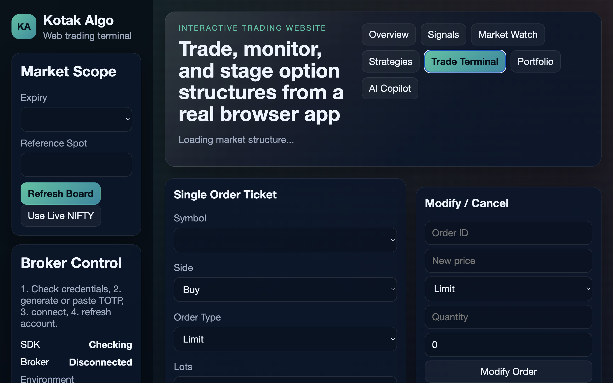 |  |
| **Trade Terminal** — Full trading interface | **Options Detail** — AI commentary beside controls |

---

## Disclaimer

**WARNING: Trading involves substantial risk of loss.**

This software is provided for **educational and personal use only**. It is not financial advice. The creators are not responsible for any financial losses incurred through the use of this software.

- Test thoroughly in a paper trading environment before live use
- Verify all orders and positions regularly
- Understand the Kotak Neo API's behavior, limits, and error handling
- The AI analysis is for reference only — always do your own research
- Angel One SmartAPI credentials are stored in `.env.angel` — keep secure

---

*Built by Dnyaneshwar Jadhav*
